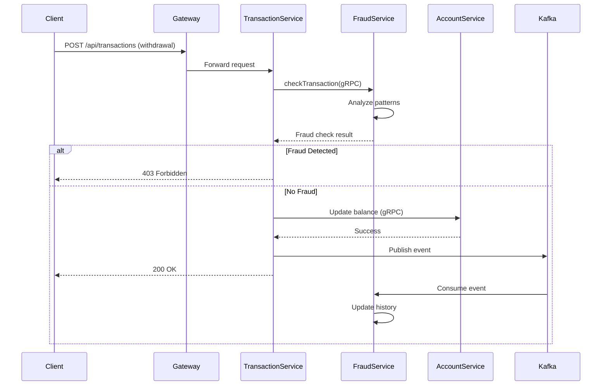

# Banking Transaction System - Technical Architecture

## System Overview

This is a distributed microservices-based banking transaction system designed to demonstrate modern software architecture patterns and inter-service communication. The system implements a real-world banking scenario with customer management, account operations, and transaction processing capabilities.

## Architecture Design

### Microservices Architecture Pattern
The system follows a domain-driven design approach with four core bounded contexts:
- **Customer Domain**: Manages customer lifecycle and profile information
- **Account Domain**: Handles account creation, status management, and balance operations
- **Transaction Domain**: Processes financial transactions with ACID guarantees
- **Fraud Domain**: Real-time fraud detection and transaction monitoring via event streaming

### Technology Stack
- **Language**: Java 17 (LTS)
- **Framework**: Spring Boot 3.4.5 with Spring Web MVC
- **Inter-Service Communication**: gRPC 1.53.0 with Protocol Buffers 3.21.12
- **Message Broker**: Apache Kafka (Confluent Platform 7.5.0) with Zookeeper
- **API Gateway**: Spring Cloud Gateway (Reactive)
- **Database**: PostgreSQL 15 with Spring Data JPA/Hibernate
- **Containerization**: Docker with multi-stage builds
- **Build Tool**: Maven 3.9.x with multi-module project structure
- **Event Processing**: Spring Kafka with manual acknowledgment
- **Serialization**: Jackson for JSON, Protocol Buffers for gRPC

## Service Architecture Details

### 1. Account Service (Port 5000/9000)

**Purpose**: Core banking service managing account lifecycle and balance operations.

**Technical Implementation**:
- **REST API Layer**: Spring MVC controllers with DTOs for request/response mapping
- **gRPC Server**: Implements `AccountServiceGrpc` with bidirectional service methods
- **Data Model**: JPA entities with optimistic locking for concurrent balance updates
- **Business Logic**: Service layer with transactional boundaries using `@Transactional`

**Key Design Patterns**:
- **Repository Pattern**: Spring Data JPA repositories for data access
- **DTO Pattern**: Separate DTOs for REST and gRPC communication
- **Mapper Pattern**: Using MapStruct for object mapping between layers

**Critical Operations**:
```java
// Balance update with optimistic locking
@Transactional(isolation = Isolation.REPEATABLE_READ)
public void updateBalance(UUID accountId, BigDecimal amount) {
    // Implements compare-and-swap pattern for thread safety
}
```

### 2. Customer Service (Port 5001/9001)

**Purpose**: Customer management with automated account provisioning.

**Technical Implementation**:
- **Orchestration Pattern**: Acts as a saga orchestrator for customer onboarding
- **gRPC Client**: Uses `AccountServiceBlockingStub` for synchronous account creation
- **Event-Driven Design**: Customer creation triggers account provisioning
- **Data Validation**: Bean Validation API with custom validators

**Inter-Service Communication**:
```java
@Service
public class CustomerService {
    private final AccountServiceClient accountClient;
    
    @Transactional
    public CustomerResponseDTO createCustomer(CustomerRequestDTO request) {
        // 1. Save customer with PENDING status
        // 2. Call Account Service via gRPC to create default account
        // 3. Update customer status to ACTIVE
        // 4. Return aggregated response
    }
}
```

**Fault Tolerance**:
- Implements circuit breaker pattern for gRPC calls
- Compensating transactions for rollback scenarios
- Idempotency keys for duplicate request handling

### 3. Transaction Service (Port 5002/9002)

**Purpose**: Financial transaction processing with distributed transaction management.

**Technical Implementation**:
- **Saga Pattern**: Implements choreography-based saga for multi-account transfers
- **Event Sourcing**: Stores transaction history with immutable records
- **CQRS Lite**: Separates balance queries from transaction commands
- **Async Processing**: Uses Spring's `@Async` for non-blocking operations

**Transaction Types**:
1. **DEPOSIT**: Single account credit operation
2. **WITHDRAWAL**: Single account debit with balance validation
3. **TRANSFER**: Two-phase commit simulation across accounts

**Consistency Guarantees**:
```java
@Transactional(propagation = Propagation.REQUIRED)
public TransactionResponseDTO processTransaction(TransactionRequestDTO request) {
    // 1. Validate account existence and status
    // 2. Check sufficient balance (for withdrawals/transfers)
    // 3. Create transaction record with PENDING status
    // 4. Update account balance(s) via gRPC
    // 5. Update transaction status to COMPLETED/FAILED
}
```

### 4. API Gateway (Port 8080)

**Purpose**: Single entry point with routing, security, and cross-cutting concerns.

**Technical Implementation**:
- **Spring Cloud Gateway**: Reactive gateway built on Project Reactor
- **Route Configuration**: Path-based routing with predicates and filters
- **Load Balancing**: Client-side load balancing ready (when scaled)
- **Observability**: Request/response logging and metrics collection

**Routing Strategy**:
```yaml
routes:
  - id: account-service
    uri: http://account-service:5000
    predicates:
      - Path=/api/accounts/**
    filters:
      - StripPrefix=1  # Removes /api prefix
```

### 5. Fraud Service (Port 5003/9003)

**Purpose**: Real-time fraud detection and transaction monitoring using event-driven architecture.

**Technical Implementation**:
- **Event Consumer**: Kafka consumer listening to `transaction-events` topic
- **gRPC Server**: Provides synchronous fraud checking for pre-transaction validation
- **Event Store**: PostgreSQL-based transaction history for pattern analysis
- **Rule Engine**: Configurable threshold-based fraud detection

**Event-Driven Architecture**:
```java
@KafkaListener(topics = "transaction-events", groupId = "fraud-service")
public void consumeTransactionEvent(TransactionEvent event) {
    // 1. Store transaction in history for analysis
    // 2. Apply fraud detection rules
    // 3. Generate alerts if thresholds exceeded
}
```

**Fraud Detection Rules**:
1. **Daily Withdrawal Limit**: 
   - Configurable via `DAILY_WITHDRAWAL_AMOUNT_LIMIT` (default: $1000)
   - Aggregates all withdrawals within 24-hour rolling window
   - Uses database indexing for efficient sum calculations

2. **Transaction Frequency Limit**:
   - Configurable via `DAILY_WITHDRAWAL_COUNT_LIMIT` (default: 5)
   - Counts withdrawal attempts per customer per day
   - Prevents rapid-fire transaction attacks

**Pre-Transaction Validation Flow**:
```java
// In Transaction Service before processing
var fraudCheck = fraudServiceClient.checkTransaction(customerId, amount);
if (fraudCheck.getIsFraudulent()) {
    throw new FraudDetectedException(fraudCheck.getReason());
}
```

## Inter-Service Communication Design

### gRPC Implementation

**Protocol Buffers Schema Design**:
```protobuf
service AccountService {
    rpc GetAccount(GetAccountRequest) returns (GetAccountResponse);
    rpc UpdateAccountBalance(UpdateAccountBalanceRequest) 
        returns (UpdateAccountBalanceResponse);
    rpc ValidateCustomer(ValidateCustomerRequest) 
        returns (ValidateCustomerResponse);
}
```

**Service Discovery**:
- Static service discovery using Docker Compose networking
- Service names resolve to container IPs within Docker network
- Configuration: `grpc.client.account-service.address=static://account-service:9000`

**Connection Management**:
- Channel pooling with `ManagedChannel` for connection reuse
- Deadline propagation for timeout handling
- Retry policies with exponential backoff

### Event-Driven Architecture with Kafka

**Apache Kafka Integration**:
- **Version**: Confluent Platform 7.5.0
- **Architecture**: Single broker setup with Zookeeper for coordination
- **Topic Design**: `transaction-events` topic with event sourcing pattern

**Event Flow Architecture**:
```
Transaction Service → Kafka → Fraud Service
        ↓                           ↓
   (Producer)                  (Consumer)
        ↓                           ↓
 Publish Event               Store & Analyze
```

**Kafka Producer Configuration** (Transaction Service):
```java
@Configuration
public class KafkaConfig {
    @Bean
    public ProducerFactory<String, TransactionEvent> producerFactory() {
        Map<String, Object> props = new HashMap<>();
        props.put(ProducerConfig.ACKS_CONFIG, "all");  // Durability
        props.put(ProducerConfig.ENABLE_IDEMPOTENCE_CONFIG, true);  // Exactly-once
        props.put(ProducerConfig.RETRIES_CONFIG, 3);
        return new DefaultKafkaProducerFactory<>(props);
    }
}
```

**Kafka Consumer Configuration** (Fraud Service):
```java
@KafkaListener(topics = "transaction-events", groupId = "fraud-service")
public void consumeTransactionEvent(@Payload TransactionEvent event,
                                  Acknowledgment acknowledgment) {
    // Manual acknowledgment for reliability
    processEvent(event);
    acknowledgment.acknowledge();
}
```

**Event Schema Design**:
```java
public class TransactionEvent {
    private UUID transactionId;      // Event key for ordering
    private UUID customerId;         // For fraud analysis
    private String transactionType;  // DEPOSIT, WITHDRAWAL, TRANSFER
    private BigDecimal amount;
    private LocalDateTime timestamp;
    private TransactionMetadata metadata;  // IP, device, location
}
```

**Benefits of Event-Driven Approach**:
1. **Decoupling**: Transaction processing independent of fraud analysis
2. **Scalability**: Fraud service can scale independently based on load
3. **Resilience**: Transactions complete even if fraud service is temporarily down
4. **Audit Trail**: Complete event history for compliance and debugging
5. **Real-time Analytics**: Stream processing capabilities for future ML models

### Data Consistency Patterns

**1. Eventual Consistency**:
- Customer status updates are eventually consistent with account creation
- Transaction history may lag behind balance updates

**2. Strong Consistency**:
- Account balances use pessimistic locking for critical sections
- Transaction processing ensures ACID properties within service boundaries

**3. Distributed Transaction Handling**:
- No distributed transaction coordinator (avoiding 2PC complexity)
- Saga pattern with compensating actions for rollbacks
- Idempotent operations to handle retries safely

## Database Design

### Schema Isolation
Each service owns its database schema with no shared tables:

**accounts_db**:
- `accounts` table: Core account data with balance
- Indexes on `customer_id` for efficient lookups
- Check constraints for balance >= 0

**customers_db**:
- `customers` table: Customer profile information
- Unique constraint on `email`
- Composite index on `(status, customer_type)`

**transactions_db**:
- `transactions` table: Immutable transaction log
- Indexes on `account_id`, `created_date`
- Partitioning ready for high-volume scenarios

**fraud_db**:
- `transaction_history` table: Event-sourced transaction data
- `fraud_alerts` table: Detected fraud incidents
- Composite indexes on `(customer_id, timestamp)` for time-range queries
- Optimized for analytical queries and aggregations

## Fraud Detection Implementation

### Real-Time Fraud Prevention Flow



### Fraud Detection Algorithm

**Rule-Based Engine Implementation**:
```java
@Service
public class FraudDetectionService {
    // Time-window based analysis
    public boolean checkTransactionForFraud(UUID customerId, String type, BigDecimal amount) {
        LocalDateTime dayStart = LocalDate.now().atStartOfDay();
        
        // Rule 1: Daily amount threshold
        BigDecimal dailyTotal = repository.sumAmountByCustomerIdAndTypeAndTimestampAfter(
            customerId, "WITHDRAWAL", dayStart);
        if (dailyTotal.add(amount).compareTo(dailyAmountLimit) > 0) {
            return true; // Fraud detected
        }
        
        // Rule 2: Transaction frequency
        long dailyCount = repository.countByCustomerIdAndTypeAndTimestampAfter(
            customerId, "WITHDRAWAL", dayStart);
        if (dailyCount >= dailyCountLimit) {
            return true; // Fraud detected
        }
        
        return false;
    }
}
```

### Event Processing Pipeline

**Asynchronous Event Handling**:
1. **Producer Side** (Transaction Service):
   - Fire-and-forget pattern for performance
   - Async callback for delivery confirmation
   - Event published after successful transaction

2. **Consumer Side** (Fraud Service):
   - Manual offset management for reliability
   - Concurrent processing with 3 consumer threads
   - Idempotent event handling

3. **Error Handling**:
   - Failed fraud checks default to allowing transactions
   - Dead letter queue for failed event processing
   - Circuit breaker pattern for service resilience

## Security Considerations

1. **Service-to-Service**: 
   - gRPC calls within private Docker network
   - No TLS for internal communication (production would require mTLS)

2. **External API**:
   - API Gateway as single entry point
   - CORS configuration for browser-based clients
   - Rate limiting ready to implement

3. **Data Protection**:
   - Sensitive data encryption at rest (PostgreSQL)
   - No PII in logs or error messages
   - SQL injection prevention via parameterized queries

## Deployment Architecture

### Container Strategy
- **Multi-stage Builds**: Separate build and runtime stages
- **Layer Caching**: Dependency layers cached for faster builds
- **Health Checks**: Each service exposes health endpoints
- **Resource Limits**: Memory and CPU limits in production

### Service Dependencies
```yaml
depends_on:
  postgres-accounts:
    condition: service_healthy
  account-service:
    condition: service_healthy
```

## Testing Strategy

1. **Unit Tests**: Service layer with mocked dependencies
2. **Integration Tests**: Repository layer with H2 in-memory database
3. **Contract Tests**: gRPC service contracts validated
4. **End-to-End Tests**: API tests through gateway

## Performance Considerations

1. **Connection Pooling**: 
   - HikariCP for database connections (default pool size: 10)
   - gRPC channel reuse with connection multiplexing
   - Kafka producer connection pooling

2. **Caching Strategy**:
   - Account balance caching candidates
   - Customer validation results cacheable
   - Fraud rule results with TTL for performance

3. **Async Processing**:
   - Kafka producer with async callbacks (fire-and-forget)
   - CompletableFuture for non-blocking operations
   - Event-driven architecture for decoupled processing

4. **Database Optimization**:
   - Composite indexes for time-range queries in fraud_db
   - Prepared statements to prevent query recompilation
   - Connection pool tuning based on load patterns

5. **Kafka Performance**:
   - Batch processing with linger.ms configuration
   - Compression enabled (snappy) for large events
   - Partition strategy based on customer ID for ordering

## Monitoring and Observability

1. **Health Checks**: Spring Boot Actuator endpoints
2. **Metrics**: Micrometer ready for Prometheus integration
3. **Distributed Tracing**: OpenTelemetry compatible
4. **Centralized Logging**: Structured logs in JSON format

## Scalability Patterns

1. **Horizontal Scaling**: Each service independently scalable
2. **Database Sharding**: Customer ID based sharding ready
3. **Read Replicas**: Read/write split possible for queries
4. **Event Streaming**: Kafka integration points identified

## Future Enhancements

1. **Event Sourcing**: Full transaction event store
2. **CQRS**: Separate read models for reporting
3. **API Versioning**: Version headers in gateway
4. **Service Mesh**: Istio/Linkerd compatibility
5. **Distributed Caching**: Redis for session/cache management

This architecture demonstrates production-ready patterns while maintaining simplicity for educational purposes. The design choices prioritize maintainability, testability, and operational excellence.